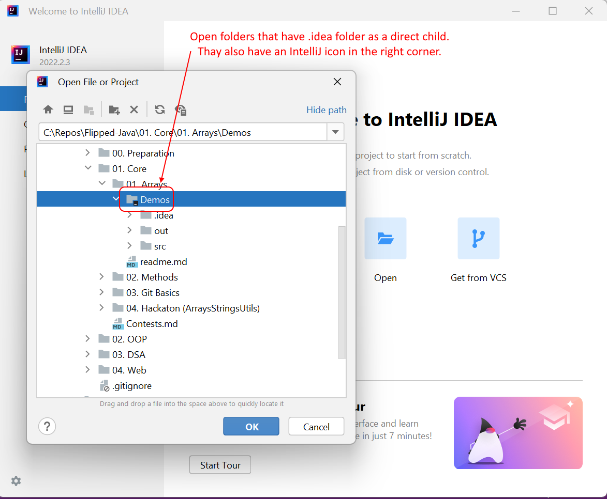

# How to store and work with IntelliJ projects in Git

When you create an IntelliJ project, besides the source code files (.java files) you get some additional folders and files. Some of them should be added to Git and other shouldn't which means that they should be included in the .gitignore file. Here is a short list of these folders and files:
- .iml file - this is a file that contains information about the project and should be added to Git
- .idea filder - this folders contains multiple files that serve different purposes
  - workspace.xml file - this is a user specific file that shouldn't be added to Git

Generally, if you use the .gitignore file that we have provided in your Alpha repo or you create new IntelliJ projects you should be all good because they are setup accordingly.

When you open an IntelliJ project, either from Windows Explorer or within IntelliJ UI, it is recommended that you open a folder that has .idea folder as a direct child directory. See the images below.

#### Open in Explorer

#### Open in IntelliJ

## Additional Resources
- [What is the .idea folder?](https://stackoverflow.com/questions/17049416/what-is-the-idea-folder)
- [IntelliJ Projects](https://www.jetbrains.com/help/idea/creating-and-managing-projects.html)
- [Manage projects under VCS](https://intellij-support.jetbrains.com/hc/en-us/articles/206544839)