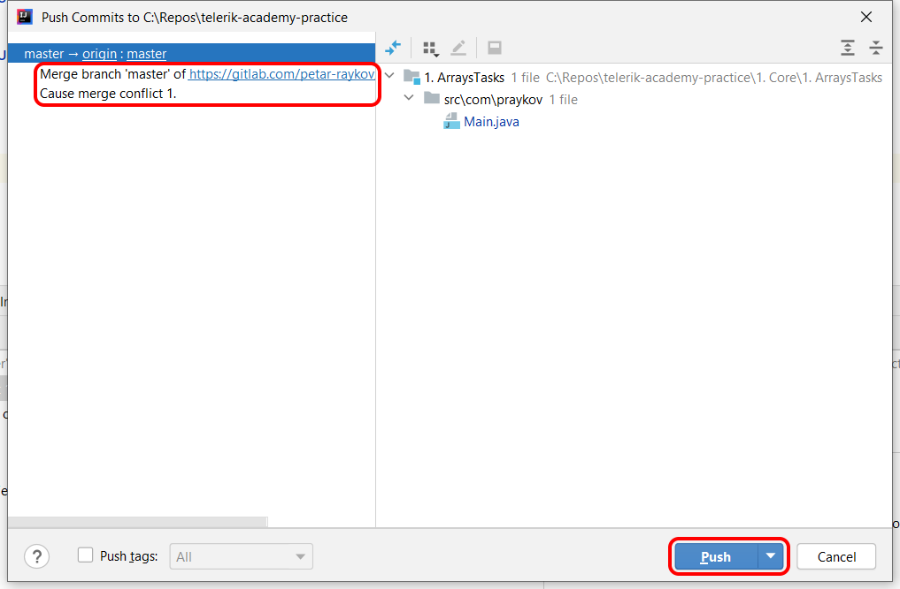
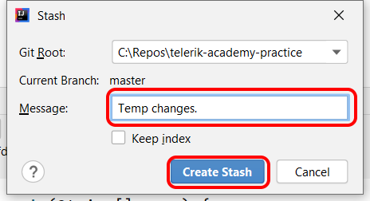

# Resolving Merge Conflicts

This tutorial explains how to resilve merge conflicts using IntelliJ. 

Table of Content  
* [Resolve using Merge command](#resolve-merge-conflict-using-merge-command)
* [Resolve using Rebase command](#resolve-merge-conflict-using-rebase-command)
* [Resolve using Stash command](#resolve-merge-conflict-before-commit-using-stash)

---

## Resolve merge conflict using `Merge` command

Now we will cause a merge conflict by updating Main.java file independently on the remote repo and the local repo.

Navigate to `Main.java` in the `GitLab` repo and update the content of the file.


```java
package com.praykov;

public class Main {

    public static void main(String[] args) {
        System.out.println("Hello Git!");

        System.out.println("Now I can modify the remote copy of the repository.");
    }
}
```

Return to IntelliJ and open the main file.


```java
package com.praykov;

public class Main {

    public static void main(String[] args) {
        System.out.println("Hello Git!");

        System.out.println("Now I can cause merge conflict with the remote copy.");
    }
}
```

`Commit` the change and `Push` the commit. Since the remote commit and the local commit have conflicting changes IntelliJ will prompt you that you need to resolve the conflict.


Choose `Merge` and you will be shown a new dialog giving more details about the conflict. Choose `Merge` again to open the merge window where you can resolve all conflicts one at a time.


In the merge window you see three versions of the file: your local changes (left), the remote changes (right) and what should be the result in the middle. You can use the commands `>>` `X` `<<` to apply or cancel a change. When you achieve the result that you need you can click `Apply`.


Now you can `Push` the changes again.


Here you can observe that you have one extra commit that is the result of the merge operation.



---

## Resolve merge conflict using `Rebase` command

Now we will cause another merge conflict using the same steps.

Update `Main.java` in the `GitLab` repo.


Go to IntelliJ and update the file too.


`Commit` the change and `Push` the commit. Since the remote commit and the local commit have conflicting changes IntelliJ will prompt you that you need to resolve the conflict.


Choose `Rebase` and follow the same steps as with the merge command.

When you resolve the conflicts perform `Push` command again. Now you can observe that there is no extra commit generated because the `Rebase` command has generated new commits on top of the remote commits including the merge changes.

---

## Resolve merge conflict before commit using `Stash`

Now we will cause a third merge conflict using the same steps.

Update `Main.java` in the `GitLab` repo.


Go to IntelliJ and update the file too.


Now `Stash` your changes so that you can `Pull` the remote changes without conflicts.




When you `Stash` your changes you put them aside and clears your local changes. As a result you can `Pull` the remote changes without any conflicts.

After you `Pull` the remote changes you can `Unstash` your local changes.


Unstashing will cause merge conflict and you will be displayed the familiar dialog where you can follow the familiar steps.


When you are done you can review your local changes, `Commit` and `Push` them.


---